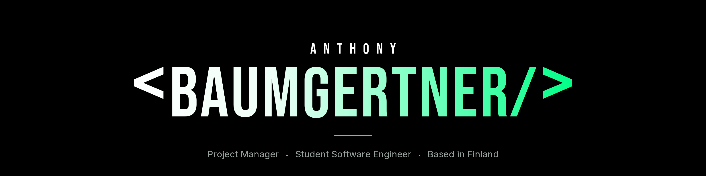
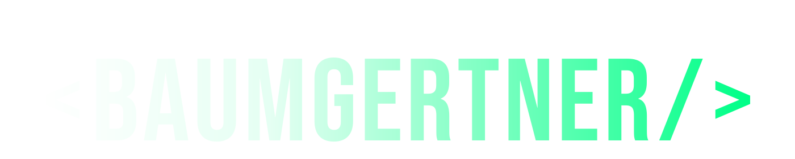

<div align="center">

<a href="https://baumgertner.fi">
  
</a>


### Baumgertner Portfolio

A full-stack personal portfolio — **React** on the front, **Express** and **PostgreSQL** behind it,<br/>
self-hosted on a VPS in four Docker containers behind **Caddy** with automatic TLS.

[](https://baumgertner.fi)

</div>

<br/>

<div align="center">

##  &nbsp;Motivation


</div>

I wanted a portfolio I could actually *own* — not a template on a hosted page builder, but something I built, deploy and maintain myself, end to end.

The easy version of this project is a static site. I deliberately didn't do that. Building a real backend meant working through problems I hadn't dealt with before: an OAuth flow where exactly one GitHub account is authorised, a database user with only the privileges it actually needs instead of connecting as `postgres`, image uploads onto a persistent volume, keeping bots off the contact form, and getting a certificate issued over the DNS-01 challenge so TLS works without exposing a challenge server.

The result runs on a single VPS in four containers, and I understand every one of them.

<br/>

<div align="center">

##  &nbsp;Key Features


</div>

- **GitHub OAuth authentication** — single-user allowlist for admin access
- **Image uploads** — stored on a persistent Docker volume and served by the API
- **Contact form** — protected by Cloudflare Turnstile
- **Automatic HTTPS** — Caddy issues and renews certificates via the Cloudflare DNS-01 challenge
- **Health-gated startup** — every container waits for its dependency to report healthy
- **Least-privilege database role** — the app connects as a restricted user, not a superuser
- **Responsive design** — built mobile-first, phone to desktop

<br/>

<div align="center">

##  &nbsp;Architecture


</div>

Four containers orchestrated with Docker Compose, each with its own healthcheck. Caddy terminates TLS and proxies to nginx, which serves the built frontend; API calls are forwarded to Express, which owns the database and the uploads volume.

```
                         ┌──────────┐
   Internet ──── 443 ───▶│  Caddy   │  TLS · DNS-01 via Cloudflare
                         └────┬─────┘
                              │
                       ┌──────▼──────┐
                       │   nginx     │  serves the Vite build
                       │  (frontend) │
                       └──────┬──────┘
                              │ /api
                       ┌──────▼──────┐        ┌──────────────┐
                       │   Express   │───────▶│  PostgreSQL  │
                       │  (backend)  │        │      17      │
                       └──────┬──────┘        └──────────────┘
                              │
                        uploads volume
```

<div align="center">

#### Frontend


</div>

- **Framework:** [React 19](https://react.dev) with [Vite 8](https://vite.dev)
- **Routing:** [React Router 7](https://reactrouter.com)
- **Typography:** [Bebas Neue](https://fonts.google.com/specimen/Bebas+Neue) + [Inter](https://fonts.google.com/specimen/Inter) via Fontsource
- **Bot protection:** [Cloudflare Turnstile](https://www.cloudflare.com/products/turnstile/)
- **Testing:** [Vitest](https://vitest.dev) with [Testing Library](https://testing-library.com) and jsdom
- **Code styling:** [ESLint](https://eslint.org)

<div align="center">

#### Backend


</div>

- **Runtime:** [Node.js](https://nodejs.org) with [Express](https://expressjs.com)
- **Database:** [PostgreSQL 17](https://www.postgresql.org)
- **Authentication:** [GitHub OAuth](https://docs.github.com/en/apps/oauth-apps) — single-user allowlist
- **Storage:** Docker volume for uploaded media
- **Access control:** dedicated least-privilege database role

<div align="center">

#### Infrastructure


</div>

- **Containers:** [Docker](https://www.docker.com) with Docker Compose
- **Web server:** [nginx](https://nginx.org) serving the static build
- **Reverse proxy & TLS:** [Caddy](https://caddyserver.com) with automatic certificates
- **DNS & certificates:** [Cloudflare](https://www.cloudflare.com) DNS-01 challenge
- **CI:** [GitHub Actions](https://github.com/features/actions)
- **Hosting:** [Hostinger](https://www.hostinger.com) VPS

<br/>

<div align="center">

##  &nbsp;Project Structure


</div>

```
.
├── .github/               # GitHub Actions workflows
├── backend/               # Express API, database layer, migrations
├── public/                # Static assets served as-is
├── scripts/               # Maintenance and setup scripts
├── src/                   # React application source
├── Caddyfile              # Reverse proxy and TLS configuration
├── Caddy.Dockerfile       # Caddy image with the Cloudflare DNS plugin
├── Dockerfile              # Frontend build → nginx
├── docker-compose.yml     # Four-service orchestration
└── nginx.conf             # Static file serving and API proxying
```

<br/>

<div align="center">

##  &nbsp;License


© 2026 Anthony Baumgertner. All rights reserved.

<br/><br/>


<picture>
  <source media="(prefers-color-scheme: dark)" srcset="./assets/wordmark-dark.png" />
  <source media="(prefers-color-scheme: light)" srcset="./assets/wordmark-dark.png" />
  
</picture>

**[baumgertner.fi](https://baumgertner.fi)** &nbsp;·&nbsp; [LinkedIn](https://www.linkedin.com/in/anthony-baumgertner/) &nbsp;·&nbsp; [GitHub](https://github.com/Baumyyy)

</div>
